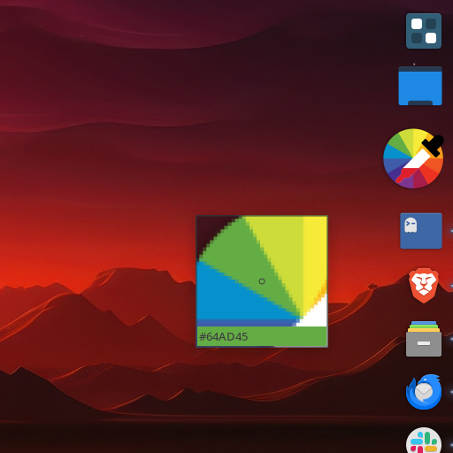
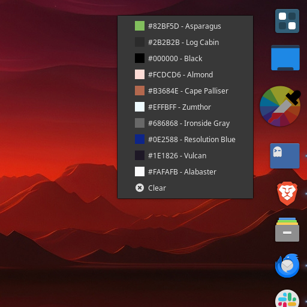

# Picky

A sleek Color Picker docklet for [Plank Reloaded](https://github.com/zquestz/plank-reloaded). Based on the original Picky sources by [hannenz](https://github.com/hannenz/picky).




## Features

- Simple color picking from any visible element on screen
- Zoom functionality for precise color selection
- Recent colors palette with quick clipboard access
- Seamless integration with Plank Reloaded dock

## Dependencies

- vala
- gtk+-3.0
- plank-reloaded

## Installation

### Method 1: Build from source

```bash
# Clone the repository
git clone https://github.com/zquestz/picky.git
cd picky

# Build and install
meson setup --prefix=/usr build
meson compile -C build
sudo meson install -C build
```

### Method 2: Arch Linux (AUR)

If you're using Arch Linux or an Arch-based distribution, you can install Picky via the AUR:

```bash
yay -S plank-reloaded-docklet-picky-git
```

## Setup

After installation, open the Plank Reloaded settings, navigate to "Docklets", and drag and drop Picky onto your dock.

## Usage

### On the dock

- **Left click**: Launch the color picker
- **Scroll wheel**: Cycle through your picked colors, copying each to the clipboard
- **Right click**: Open the palette of recently picked colors (10 by default); click a color to copy its value to the clipboard

### While picking

- **Left click**: Pick the color and close the picker
- **Right click**: Pick the color and keep picking
- **Space / Enter**: Pick the color and close (hold **Shift** to keep picking)
- **Mouse wheel**: Zoom in/out
- **Arrow keys** or **h/j/k/l**: Move the pointer one pixel at a time
- **F9 / F10**: Shrink / grow the preview window
- **Esc**: Close the picker without picking

## License

This project is licensed under the GNU General Public License v3.0 (GPL-3.0). See the [LICENCE](LICENCE) file for details.

## Contributing

Contributions are welcome! Please feel free to submit a Pull Request.
