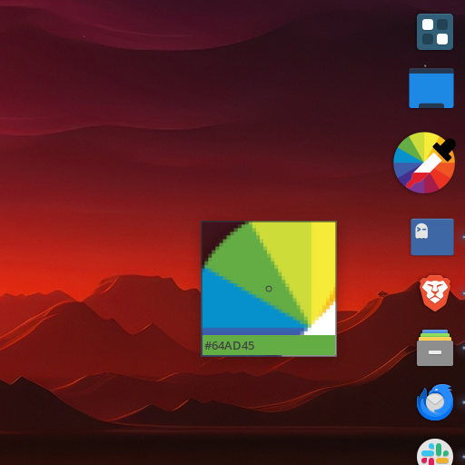

# picky

Color Picker docklet for [Plank Reloaded](https://github.com/zquestz/plank-reloaded). Based on the original Picky sources at:

[https://github.com/hannenz/picky](https://github.com/hannenz/picky)




## Dependencies

- vala
- gtk+-3.0
- plank-reloaded

## Installation

```
# Clone the repository
git clone github.com/zquestz/picky.git
cd picky

# Build and install
meson setup --prefix=/usr build
meson compile -C build
sudo meson install -C build
```

Go to the Plank Reloaded settings, choose "Docklets", drag and drop Picky onto your dock.

## Usage

Left click: Launch color picker

Mouse Wheel: Zoom in / out while picking

Right click: Open palette (10 recently picked colors), click on a
color to copy to clipboard
